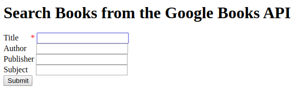

# Search from Google Books API  
This repository is a project I made to practice consuming from a 3rd part API.  
&nbsp;  
**You need to put you own API KEY in the *application.conf***

### Usage  
I've made a simple html page to simplify the request.  
Only the *title* is mandatory.  
&nbsp;  
